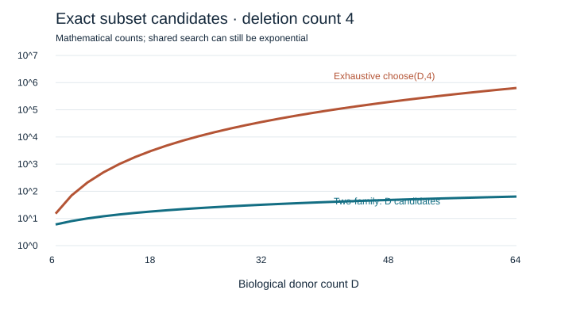

# ExtremaRank

[Repository](https://github.com/heise3/ExtremaRank) ·
[Releases](https://github.com/heise3/ExtremaRank/releases) ·
[Report an issue](https://github.com/heise3/ExtremaRank/issues)

**Which of your omics candidates survive removing a few biological samples?**

ExtremaRank audits whether omics candidates survive shared sample deletion.
v0.4 ships a **native R package**: exact R/C++ computation, direct Bioconductor
model refits, sparse donor pseudobulk and experiment-object interfaces.
It runs entirely in R without Python, reticulate or a subprocess bridge.
The existing Python implementation also provides **individual membership/sign certificates**, **minimum deletion
change bounds**, **safe Welch pruning**, **automatic limma/voom/edgeR/DESeq2
refits**, and **donor-level single-cell pseudobulk**.

The Python core has **no third-party dependencies** and runs on Python 3.10+.
The R package uses Rcpp, BH, Matrix and digest, with optional Bioconductor models.
Real examples cover paired bulk RNA-seq, independent microarrays, an 8-donor
single-cell study, technical protein measurements, and biological lipid data.
Native certificates and observed external-model refits have different guarantees.

[原生 R 包中文指南](docs/R_NATIVE_CN.md) · [R package](r/extremarank) ·
[中文 v0.3 说明](docs/V03_CN.md) · [Individual certificates](docs/ROBUSTNESS.md) ·
[Model refits / single cell](docs/REFITS.md) · [Study inputs](docs/STUDY.md) ·
[Proof](docs/THEOREM.md) · [Prior art](docs/PRIOR_ART.md) ·
[Data attribution](DATA_LICENSE.md) · [Example report](results/v03/nutrimouse-up/report.html)

## Install and run

### Native R

```r
install.packages(c("Rcpp", "BH", "Matrix", "digest"))
install.packages(
  "https://github.com/heise3/ExtremaRank/releases/download/v0.4.0/extremarank_0.4.0.tar.gz",
  repos = NULL, type = "source")
library(extremarank)

# x: features in rows, samples in columns; metadata has sample_id/group/donor_id.
result <- extremarank(x, metadata, target = "treated", reference = "control",
                     design = "paired", k = 20, budget = 2)
result$features
write_extremarank(result, "my-r-audit")
```

For precomputed donor-by-feature effects, call `extremarank_effects(effects)`.
For independent groups, use `design = "welch"`. To run limma, limma-voom, edgeR
or DESeq2 directly in R, call `refit_extremarank()`. For SingleCellExperiment
raw counts, call `pseudobulk_extremarank(sce, assay = "counts")` before analysis.
These models retain an **observed sensitivity** scope. Native exact audits
can return certificates for the declared deletion budget.

Source installation needs a C++17 compiler (Rtools on Windows, Xcode command
line tools on macOS). There is no Python installation step. See the
[R package README](r/extremarank/README.md) for a runnable toy example and
[native R validation](results/v04/README.md) for actual verification results.
The small R source archive installs without downloading the full benchmark
repository. Alternatively, use `remotes::install_github("heise3/ExtremaRank",
subdir = "r/extremarank", ref = "v0.4.0", upgrade = "never")`.

### Python

```bash
python -m pip install .
# Independent two-group study, including sample diagnostics and report.html.
extremarank study data/prepared/Golub/matrix.csv.gz \
  --metadata data/prepared/Golub/metadata.tsv --target AML --reference ALL \
  --design welch --budget 2 --top-k 20 --feature-audit --output golub-audit

# Original exact paired-effects interface remains available.
extremarank examples/variance_reversal.tsv --budget 1 --top-k 1 --output my-audit
```

For `study`, supply a feature-by-sample matrix and aligned sample metadata;
declare target/reference and the paired or independent design. Explicit
preparation, missing-feature exclusion and incomplete-pair policies are
documented in the [study guide](docs/STUDY.md). Existing external refits can be
compared with `extremarank compare`. `extremarank refit` executes four declared
R model adapters and retains non-estimable scenarios. `extremarank pseudobulk`
aggregates raw single-cell counts by donor, condition and cell type.
See the [refit/single-cell guide](docs/REFITS.md).

For the original paired-effects CLI, put donor IDs in the first column and one feature per remaining
column. Values are **already prepared within-donor target-minus-reference
effects**. Freeze normalization, pairing and the feature universe before
auditing. The software checks unique IDs and finite rectangular data.

```text
donor_id    gene_A    gene_B
donor_1     2.0       1.0
donor_2     2.1       1.1
donor_3     1.9       0.9
donor_4    10.0       2.0
```

```bash
# Both up- and down-regulated candidates, ranked by absolute paired t.
extremarank my-effects.csv --direction absolute --budget 2 --top-k 20 --output my-audit

# Exact gene envelopes without running the potentially larger shared search.
extremarank my-effects.csv --budget 4 --skip-topk --output gene-envelopes
```

The output directory contains:

- `summary.tsv`: baseline rank, worst/best signed t, robust positive/negative
  direction, and donor witnesses with recomputed mean and variance.
- `envelopes.tsv`: exact signed score extrema for each deletion count.
- `audit.json`: `CERTIFIED`, `REFUTED` with one shared deletion witness, or
  `UNRESOLVED` at the declared node limit; input hash and parameters included.

`CERTIFIED` concerns the unordered Top-K set over **every deletion of at most
the budget**. It does not say the internal order is unchanged. All-zero values
use descriptive score zero; nonzero constant vectors use extended t of ±∞.
These conventions are recorded explicitly and do not define inferential p-values.

## The algorithmic contribution

The theorem below concerns the **paired** mode. The independent Welch mode
uses exact moment comparisons and conservative rational conditional bounds;
it can prune favorable inputs but does not inherit the paired extremum theorem. External-table comparisons use only supplied
scenarios and report `OBSERVED_STABLE`/`OBSERVED_CHANGED`, not certificates.

For retained effects, let `S = sum(x)` and `Q = sum(x²)`. At a fixed retained
count, signed paired-t ranking is equivalent to `R = S/sqrt(Q)`.

Our conditional two-family extremum theorem shows that, even when some donors
are forced to stay, both extrema over all fixed-size subsets occur among:

1. Contiguous blocks of sorted optional donor values.
2. A prefix plus a suffix of the same combined size.

The union has at most `D+2` representations, compared with `choose(D,m)` subsets.
Prefix moments evaluate it in linear arithmetic work after sorting. The
implementation removes duplicate end blocks. Exact dyadic integer sums and
cross-products make every selection/ranking decision exact for the supplied
binary64 input; decimals shown in reports are only displays.

This oracle also bounds each node of a shared-donor search. Independent feature
interval overlap is never treated as a ranking counterexample. The full search
can still be exponential; a finite node limit reports `UNRESOLVED` honestly.
Absolute ranking uses exact absolute maxima but a conservative zero lower bound
when the signed interval crosses zero.

The contribution is the specific conditional signed two-family characterization,
its exact oracle, and its use in this audit. Ordered trimming, robustness audits,
quadratic transforms, and generic branch-and-bound all have prior art. The
[comparison](docs/NOVELTY.md) states those overlaps and retrieval gaps. This is
an independently derived, proved and tested research implementation, without a
claim of global mathematical priority or peer-reviewed novelty.

## Executed public-data benchmark



Both studies use verified biological pairing and public NCBI count matrices.
The prepared paired log2(CPM+1) effects and the complete provenance are bundled.
Deletion budgets `0..4`, the filter and the matched first 100 eligible features
were declared before evaluating outcomes.

| Dataset | Genuine pairs | Eligible genes | Whole-matrix scalar extrema, 5 counts | Matched speed vs exact enumeration |
|---|---:|---:|---:|---:|
| GSE87290, PBMC baseline → LPS | 14 | 13,328 | 1.385 s | 22.24× |
| GSE50760, normal colon → primary CRC | 18 | 16,597 | 2.077 s | 55.29× |

These are one-machine timings on arm64 macOS/Python 3.12. Matched timings use
the same exact arithmetic, include sorting, and compare 100 fixed features at
each of five counts: **0 extrema mismatches in 1,000 calls**. Whole-matrix times
exclude preparation, serialization, ablations and joint Top-K search. They are
not speed comparisons against approximate DE tools.

The full public CLI, including input parsing, scalar envelopes, shared Top-20
audit and output writing, took 2.85 s / 3.94 s on the two matrices. Executed TSV
tables in this distribution are losslessly compressed as `.tsv.gz`; the
archive manifest records both byte hashes. Rerunning the CLI/benchmarks writes
ordinary TSVs. The offline HTML embeds its displayed results and needs neither.

At four deletions, block-only candidates miss true lower extrema for 15.05% /
22.27% of features; endpoint-only candidates miss upper extrema for 4.88% /
6.46%. The two-family result therefore changes actual answers in both datasets.

The full eligible Top-20 set has verified one-donor counterexamples in **all
three ranking directions in both studies**. For upward ranking, deleting
`PBMC_replicate_5` changes one list member, and deleting `AMC_6` changes four.
Each baseline and replacement ranking was replayed independently with Fraction
arithmetic. This demonstrates a usable sensitivity report, not biological
ground truth or a reason to remove those donors from the experiment.

Independent checks include 200,000 exact scalar scenarios with forced inclusion
and exhaustive shared-subset ranking tests. See the JSON files in `results/`.

### v0.2 independent-group and external-model validation

The complete public Golub processed microarray training matrix has 27 ALL / 11
AML samples and 3,051 provider-selected features. Native Welch Top-20 audits
at budgets 1 and 2 found independently replayed shared-deletion witnesses in
all three ranking directions. Every feasible delete-one scenario was inspected:

| Ranking | Welch delete-one changes | Refitted limma delete-one changes |
|---|---:|---:|
| Up | 27 / 38 | 28 / 38 |
| Down | 34 / 38 | 30 / 38 |
| Absolute | 38 / 38 | 33 / 38 |

117 full-feature Welch rankings matched independent Fraction arithmetic;
117 external limma Top-20 sets matched the R exporter. The external interface
reports observed changes only. An additional 2,000 small Welch problems passed
91,227 exact rank comparisons and 6,000 complete status checks. All 44 package
tests passed locally on Python 3.12 and 3.14. See the
[frozen contract](benchmarks/upgrade_contract.json), [real results](results/upgrade_real.json)
and [workflow guide](docs/STUDY.md). These are sensitivity checks, not disease
classification or biomarker-validation results.

## v0.3: partial stability and real cross-omics validation

With deletion budget 2, individual certificates retain useful candidates even
when the whole original shortlist changes:

| Real input, upward ranking | Independent deletion units | Frozen features | Certified original members | Certified effect signs |
|---|---:|---:|---:|---:|
| Golub microarray | 38 samples | 3,051 | 6 / 20 | 20 / 20 |
| Kang B-cell pseudobulk | 8 paired donors | 35,635 | 6 / 20 | 20 / 20 |
| CPTAC protein measurements | 6 technical runs | 1,097 | 4 / 20 | 20 / 20 |
| Nutrimouse lipid percentages | 40 biological mice | 21 | 4 / 5 | 5 / 5 |

For Nutrimouse upward Top-5, **every single-mouse deletion preserves membership,
but a verified two-mouse deletion changes it**: the exact minimum change is 2.
The other three upward lists have verified one-unit changes. These are ranking
sensitivity outcomes, not biological ground truth. Technical protein runs do
not substitute for independent biological replication. Lipid percentages are
compositions, not absolute metabolite concentrations.

The new checker completed **6,000 native design/direction problems and
1,434,768 property/enclosure checks with zero failures**. Real baseline and
all distinct reported witnesses matched **183 independent full-feature Fraction
rankings**. Single-cell aggregation matched **4,347,470 independent R sums**.
Automatic refits matched **300 R-exported Top-K sets** in three directions.
All 59 tests passed locally including optional H5AD and all four R adapters.

One frozen Kang edgeR signed-sqrt-QL-F ranking is `NOT_EVALUABLE`: tiny negative
raw QL F values prevent finite scores in its baseline and six refits. The
original rows and failed fits are preserved; genes are not removed or scores
clipped to manufacture coverage. Limma-voom and DESeq2 completed all eight
paired donor refits. The edgeR adapter passes a separate complete integration
fixture. See [real results](results/validation_v03_real.json).

On the predefined separated stable Welch example (100 samples, budget 3),
enumeration checked 166,750 subsets; the safe search inspected 24 subsets and
9 bound nodes for the same certificate. This favorable synthetic case does
not establish typical or worst-case speed. A tied finite-limit case remains
`UNRESOLVED`. See [pruning results](results/welch_pruning_v03.json).

## Reproduce offline

```bash
python -m unittest discover -s tests -v
python benchmarks/independent_theorem_check.py
python benchmarks/search_ablation.py
python benchmarks/scaling.py
python benchmarks/independent_welch_check.py --cases 2000
python benchmarks/upgrade_real.py
python benchmarks/independent_robustness_check.py --cases 1000
python benchmarks/welch_pruning_v03.py

# Only raw-count preparation / full real-data reproduction needs NumPy.
python -m pip install '.[benchmark]'
python data/fetch_sources.py --offline
python benchmarks/real_data.py
python benchmarks/real_topk.py
```

No GPU, FASTQ processing, private database login, or network access is needed
for these bundled reproductions. Missing source files can be restored with
`data/fetch_sources.py`, which checks pinned SHA256 values and refuses drift.

## Scope

Use the native audits for fixed paired effects or independent-group Welch
rankings. Both compare exact input statistics and may report `UNRESOLVED` at a
finite search limit. Use the external-table interface for observed refit
scenarios from other models. Input preparation is frozen in native audits;
the external refitting pipeline controls its own preparation. No workflow
estimates FDR, models cell types, measures prediction accuracy, or guarantees
biomarker validation. Broader model compatibility of `compare` does not imply
an exact all-deletion theorem for those external models.

Software: MIT. Third-party data attribution: [data/DATA_LICENSE.md](data/DATA_LICENSE.md).
Questions, counterexamples to the theorem, independently verified datasets and
new target models are useful contributions; see [CONTRIBUTING.md](CONTRIBUTING.md).

For the full v0.3 public validation, install R with `limma`, `edgeR`, `DESeq2`,
`Matrix`, `SummarizedExperiment` and `SingleCellExperiment`, then run:

```bash
python data/fetch_v03_sources.py --offline
python benchmarks/reproduce_v03.py
# Verify/regenerate reports using bundled prepared inputs, without source export:
python benchmarks/reproduce_v03.py --checks-only
```

Optional H5AD integration: `pip install '.[single-cell]'`. R integration tests:
`EXTREMARANK_R_TESTS=1 python -m unittest discover -s tests -v`.
The wheel contains the R adapter but no large datasets. The source release
contains fixed raw/prepared public inputs and results for offline reproduction.
Large execution tables are losslessly gzipped, with both byte hashes recorded
in [archive_v03.json](results/archive_v03.json); reruns write ordinary tables.
